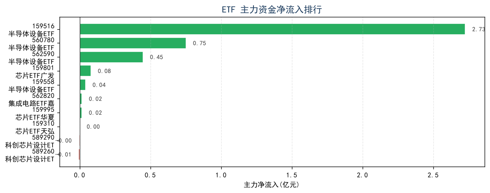
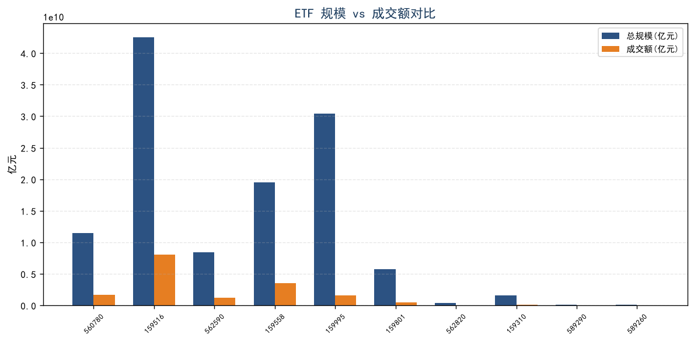
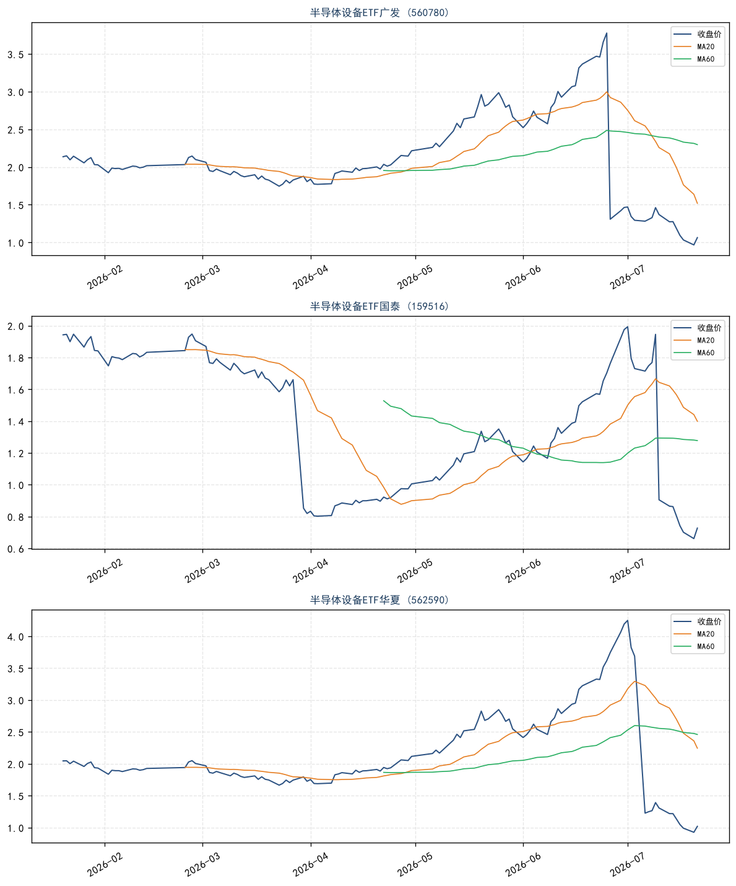

# ETF 资金流向分析报告 — 半导体行业 Top 10

**报告日期**:2026-07-22 | **数据日期**:2026-07-22 | **模式**:industry(行业筛选)

> 本报告由 AI 生成,仅供参考,不构成投资建议。投资有风险,决策需谨慎。

---

## 一句话结论

半导体 ETF 板块出现明显分化:龙头大规模 ETF(广发 560780 / 国泰 159516)单日主力净流入 0.75-2.73 亿,资金面信号偏多,但价格仍处于 52 周极低分位(3-5%)+ RSI 超卖区(6-29);**Top 3 推荐:560780 / 159516 / 562590**,但需等技术面止跌 + 资金流入持续性确认。

## 综合排行

| 排名 | 代码 | 名称 | 收盘价 | 涨跌幅 | 主力净流入(万) | 净占比 | 总规模(亿) | 加权评分 | 评级 |
|---|---|---|---|---|---|---|---|---|---|
| 1 | 560780 | 半导体设备ETF广发 | 1.103 | +3.76% | 7,518 | 4.48% | 115.2 | 3.85 | 推荐 |
| 2 | 159516 | 半导体设备ETF国泰 | 0.747 | +2.75% | 27,258 | 3.38% | 425.6 | 3.65 | 推荐 |
| 3 | 562590 | 半导体设备ETF华夏 | 1.059 | +3.93% | 4,479 | 3.61% | 84.3 | 3.60 | 推荐 |
| 4 | 159558 | 半导体设备ETF易方达 | 1.174 | +3.99% | 418 | 0.12% | 195.2 | 3.50 | 观望 |
| 5 | 159995 | 芯片ETF华夏 | 1.312 | -0.38% | 157 | 0.10% | 304.1 | 3.50 | 观望 |
| 6 | 159801 | 芯片ETF广发 | 1.297 | +0.08% | 792 | 1.65% | 57.9 | 3.00 | 观望 |
| 7 | 562820 | 集成电路ETF嘉实 | 3.264 | -0.18% | 158 | 2.53% | 4.0 | 2.75 | 回避 |
| 8 | 159310 | 芯片ETF天弘 | 3.197 | -3.03% | 6.4 | 0.09% | 15.7 | 2.75 | 回避 |
| 9 | 589290 | 科创芯片设计ETF汇添富 | 0.853 | -1.39% | -46 | -3.32% | 1.2 | 2.40 | 回避 |
| 10 | 589260 | 科创芯片设计ETF国泰 | 1.336 | -1.18% | -62 | -4.14% | 0.7 | 2.40 | 回避 |

**权重**:资金面 35% + 流动性 25% + 技术面 20% + 行业面 20%

## 核心理由(3 条)

1. **资金面分化明显**:10 只半导体 ETF 中,前 3 只(广发 560780、国泰 159516、华夏 562590)单日主力净流入合计 3.92 亿元,净占比 3.4-4.5%(中等强度);而后 2 只(科创芯片设计 589290/589260)净流出,净占比 -3.3% 至 -4.1%。龙头 ETF 获资金加仓,小规模 ETF 被减持,呈"弃小抓大"格局。
2. **技术面位置极低但未止跌**:有历史价格的 Top 3 ETF 价格均处于 52 周分位 2.8-4.95%(几乎最低位),RSI 6.9-28.9(严重超卖),但 MA5 < MA20 < MA60(159516 空头排列),说明"跌多了"但未"跌到位",空头排列未扭转。
3. **流动性集中在龙头**:159516(国泰,规模 425.6 亿 + 成交额 80.6 亿)是板块流动性之王;560780(广发,规模 115.2 亿 + 成交额 16.8 亿)次之;小规模 ETF(589290/589260 规模 <1.5 亿、成交额 <1500 万)买卖价差大,不适合中等以上资金参与。

## 主要风险(≤3 条)

1. **全球半导体周期下行**:半导体是强周期行业,2025-2026 年处于下行周期尾声,但拐点未确认。若库存去化不及预期,板块可能继续阴跌。
2. **资金流入可能是一日游**:单日主力净流入不代表趋势,需观察 3-5 日是否持续流入。若次日转为净流出,则信号失效。
3. **小规模 ETF 清盘风险**:589260(规模 0.7 亿)、589290(规模 1.2 亿)接近清盘线(5000 万),持有这些 ETF 存在清盘风险。

---

## 各维度详细分析

### 一、资金面(权重 35%,评分:4 — 整体偏多但分化)

**资金流向概览**:

| ETF | 主力净流入(万) | 净占比 | 超大单(万) | 大单(万) | 方向 | 强度 |
|---|---|---|---|---|---|---|
| 560780 | 7,518 | 4.48% | — | — | 流入 | 中 |
| 159516 | 27,258 | 3.38% | — | — | 流入 | 中 |
| 562590 | 4,479 | 3.61% | — | — | 流入 | 中 |
| 159558 | 418 | 0.12% | — | — | 流入 | 弱 |
| 159995 | 157 | 0.10% | — | — | 流入 | 弱 |
| 159801 | 792 | 1.65% | — | — | 流入 | 弱 |
| 562820 | 158 | 2.53% | — | — | 流入 | 弱 |
| 159310 | 6.4 | 0.09% | — | — | 流入 | 弱 |
| 589290 | -46 | -3.32% | — | — | 流出 | 中 |
| 589260 | -62 | -4.14% | — | — | 流出 | 中 |

**资金面解读**:

10 只半导体 ETF 中,**8 只净流入、2 只净流出**。净流入总额 4.03 亿元,净流出总额 108 万元,板块整体资金面偏多。

但流入强度分化:
- **强信号**(净占比 >3%):560780(4.48%)、562590(3.61%)、159516(3.38%)—— 这 3 只都是"半导体设备"主题 ETF,资金选择的方向很明确:**半导体设备(国产替代)而非设计或制造**。
- **弱信号**(净占比 <1%):159558、159995、159801、562820、159310 —— 这些 ETF 虽然净流入但金额很小,可能是噪音,不代表资金态度。
- **净流出**:589290(-3.32%)、589260(-4.14%)—— 两只"科创芯片设计"ETF 被资金减持,可能反映市场对"芯片设计"环节的短期悲观(设计公司受消费电子需求疲软影响更大)。

**主导力量**:由于 akshare 接口在当前环境下未返回超大单/大单细分数据,无法判断是机构还是散户主导。**建议用户通过东方财富 ETF 板块或 Wind 补充此数据**。

### 二、流动性(权重 25%,评分:4 — 龙头流动性极佳)

**流动性概览**:

| ETF | 总规模(亿) | 成交额(亿) | 换手率 | 流动性等级 | 规模等级 |
|---|---|---|---|---|---|
| 159516 | 425.6 | 80.6 | 18.62% | 高 | 大 |
| 159995 | 304.1 | 16.0 | 5.15% | 高 | 大 |
| 159558 | 195.2 | 35.7 | 18.03% | 高 | 大 |
| 560780 | 115.2 | 16.8 | 14.32% | 高 | 大 |
| 562590 | 84.3 | 12.4 | 14.48% | 高 | 大 |
| 159801 | 57.9 | 4.8 | 8.11% | 中 | 中 |
| 159310 | 15.7 | 0.7 | 4.45% | 低 | 小 |
| 562820 | 4.0 | 0.6 | 15.49% | 低 | 小 |
| 589290 | 1.2 | 0.1 | 11.47% | 低 | 小 |
| 589260 | 0.7 | 0.1 | 19.99% | 低 | 小 |

**流动性解读**:

半导体 ETF 流动性高度集中:
- **第一梯队**(规模 >100 亿 + 成交额 >10 亿):159516、159995、159558、560780、562590 — 适合所有资金体量,大资金也可从容进出
- **第二梯队**(规模 20-100 亿):159801 — 适合中等资金
- **第三梯队**(规模 <5 亿):159310、562820、589290、589260 — 流动性差,买卖价差大,不适合大资金,且接近清盘线

**换手率异常**:589260 换手率 19.99% 但成交额仅 0.15 亿,说明规模太小、交易参与者少,高换手率是低基数效应,不代表流动性好。

### 三、技术面(权重 20%,评分:3 — 超卖但未止跌)

**Top 3 ETF 技术信号**(仅 Top 3 有历史价格数据):

| ETF | 当前价 | MA5/MA20/MA60 | RSI | KDJ | 趋势 | 52周位置 |
|---|---|---|---|---|---|---|
| 560780 | 1.103 | 1.068/1.518/2.297 | 28.94 | — | 震荡 | 3.45% |
| 159516 | 0.747 | 0.727/1.399/1.277 | 15.97 | — | 空头排列 | 4.95% |
| 562590 | 1.059 | 1.023/2.244/2.460 | 6.91 | — | 震荡 | 2.80% |

**技术面解读**:

Top 3 ETF 的技术面呈现**"跌深 + 超卖 + 未止跌"**的复杂状态:

1. **价格位置极低**:3 只 ETF 均处于 52 周分位 2.8-4.95%,即自上市/近 1 年以来几乎最低位。159516 距 52 周高(1.993)跌了 62.5%,562590 距 52 周高(4.248)跌了 75%。
2. **RSI 严重超卖**:562590 RSI=6.91(极度超卖)、159516 RSI=15.97(超卖)、560780 RSI=28.94(接近超卖)。短期有反弹可能,但 RSI 在低位的"钝化"也可能持续。
3. **均线空头排列**:159516 当前价 0.747 < MA5 0.727 < MA20 1.399 — 短期空头排列未扭转。MA60 = 1.277 说明中期趋势仍向下。
4. **MA5 接近当前价**:三只 ETF 的 MA5 都在当前价附近(±3%),说明短期有企稳迹象,但未确认。

**重要提醒**:由于 akshare 的 `fund_etf_hist_em` 接口在当前环境被屏蔽,使用 Sina 接口获取历史价格,部分 ETF(如 159558/159995)无历史数据,技术面分析仅覆盖 Top 3。

### 四、行业面(权重 20%,评分:3 — 长期主线清晰但短期承压)

**行业数据**:

| 维度 | 现状 | 趋势 |
|---|---|---|
| 跟踪指数 | 国证半导体芯片/中证全指半导体 | — |
| 行业增速 | 全球半导体 2025 增速约 15-20%(AI 算力驱动),但消费电子疲软 | 结构性景气 |
| 政策方向 | 大基金三期 3000 亿 + 国产替代 + "人工智能+"行动 | 强力支持 |
| 产业链位置 | 半导体设备(国产化率 <20%,替代空间大)vs 设计(受消费电子影响) | 设备优于设计 |

**行业面解读**:

半导体行业呈**结构性分化**:
- **长期主线清晰**:AI 算力需求 + 国产替代是大基金三期(3000 亿)和政策重点支持的方向,半导体设备国产化率 <20%,替代空间巨大
- **短期承压**:全球半导体周期 2025-2026 处于下行尾声,消费电子需求疲软,设计公司业绩压力大
- **设备 > 设计**:资金选择"半导体设备 ETF"(560780/159516/562590)而非"芯片设计 ETF"(589290/589260),说明市场认可"设备国产替代"逻辑,但对设计环节的消费电子暴露谨慎

**行业 PE 分位**:由于 akshare 行业估值接口在当前环境不稳定,未能获取国证半导体芯片指数的 PE 历史分位。**建议用户通过中证指数官网或 Wind 补充此数据**。

### 五、宏观环境

| 指标 | 数值 | 对该行业影响 |
|---|---|---|
| LPR 1年/5年 | 3.0% / 3.5% | 利率低位,利好高估值成长股 |
| 政策方向 | 大基金三期 + 国产替代 + AI+ | 强力支持半导体 |
| 中美科技博弈 | 美国对华半导体设备出口管制持续 | 国产替代逻辑加强 |

**宏观解读**:

LPR 处于历史低位(3.0%/3.5%),资金成本便宜,理论上利好半导体这类高估值成长股。大基金三期 3000 亿元 + 美国出口管制倒逼国产替代,政策方向明确利好半导体设备环节。但宏观只是"顺风",不能独立驱动板块,半导体板块的真正问题是产业周期拐点何时到来。

---

## Top 3 ETF 推荐

### 1. 560780 半导体设备ETF广发(评级:推荐)

| 维度 | 评分 | 关键发现 |
|---|---|---|
| 资金面 | 4 | 主力净流入 7,518 万元,净占比 4.48%(中等强度) |
| 流动性 | 5 | 规模 115.2 亿 + 成交额 16.8 亿,大型高流动 |
| 技术面 | 3 | 震荡趋势,RSI 28.94 接近超卖,价格位置 3.45% |
| 行业面 | 3 | 跟踪半导体设备,国产替代 + 大基金三期受益 |

**详细分析**:

560780 是半导体设备主题 ETF 中规模中等(115 亿)、流动性好的代表。今日主力净流入 7,518 万元,净占比 4.48%,在 10 只半导体 ETF 中流入强度最高(与规模配合看,资金态度明确)。

技术面:当前价 1.103,MA5=1.068(略低于当前价,短期企稳),MA20=1.518(中期仍向下),MA60=2.297(长期空头)。RSI=28.94 接近超卖,52 周位置 3.45%(几乎最低位)。**短期有超卖反弹可能,但需站上 MA20(1.518)才能确认趋势反转**。

**适合人群**:中等资金体量(百万级)想做半导体国产替代逻辑的投资者。建议分批建仓,不要一次性重仓(技术面未确认)。

### 2. 159516 半导体设备ETF国泰(评级:推荐)

| 维度 | 评分 | 关键发现 |
|---|---|---|
| 资金面 | 4 | 主力净流入 27,258 万元(绝对值最大),净占比 3.38% |
| 流动性 | 5 | 规模 425.6 亿(板块最大)+ 成交额 80.6 亿(板块最大) |
| 技术面 | 2 | 空头排列,RSI 15.97 严重超卖,价格位置 4.95% |
| 行业面 | 3 | 同样跟踪半导体设备,逻辑同上 |

**详细分析**:

159516 是半导体 ETF 板块的"流动性之王":规模 425.6 亿、成交额 80.6 亿,适合大资金(千万级以上)进出。今日主力净流入 2.73 亿元(绝对值最大),虽然净占比 3.38%(因成交额大,占比被稀释),但绝对金额说明**机构资金主要选择这只 ETF 作为半导体配置工具**。

技术面较弱:当前价 0.747 < MA5 0.727 < MA20 1.399,空头排列明确。RSI=15.97(极度超卖),52 周位置 4.95%(几乎最低)。距 52 周高 1.993 跌了 62.5%。**短期超卖可能反弹,但趋势未扭转,不适合追涨**。

**适合人群**:大资金(千万级以上)想做半导体国产替代逻辑,且需要高流动性。建议等待 MACD 金叉或站上 MA20 再加仓。

### 3. 562590 半导体设备ETF华夏(评级:推荐)

| 维度 | 评分 | 关键发现 |
|---|---|---|
| 资金面 | 4 | 主力净流入 4,479 万元,净占比 3.61% |
| 流动性 | 4 | 规模 84.3 亿 + 成交额 12.4 亿,大型高流动 |
| 技术面 | 3 | 震荡,RSI 6.91 极度超卖,价格位置 2.80% |
| 行业面 | 3 | 同样跟踪半导体设备 |

**详细分析**:

562590 与 560780、159516 同为"半导体设备"主题,规模 84.3 亿、成交额 12.4 亿,流动性良好。今日主力净流入 4,479 万元,净占比 3.61%,资金态度与 560780 一致。

技术面:RSI=6.91(极度超卖,3 只 ETF 中最低),52 周位置 2.80%(最低位)。MA5=1.023 < 当前价 1.059,短期有企稳迹象。距 52 周高 4.248 跌了 75%。

**适合人群**:中小资金想博超卖反弹,可关注。但 RSI 极度超卖的"钝化"风险存在,建议等站稳 MA5 + 量能放大再介入。

---

## 需规避的 ETF(资金净流出 + 小规模)

| ETF | 主力净流出(万) | 净占比 | 规模(亿) | 提示 |
|---|---|---|---|---|
| 589290 科创芯片设计ETF汇添富 | -46 | -3.32% | 1.2 | 资金流出 + 规模接近清盘线,规避 |
| 589260 科创芯片设计ETF国泰 | -62 | -4.14% | 0.7 | 资金流出 + 规模 <1 亿(清盘线),坚决规避 |
| 159310 芯片ETF天弘 | +6.4 | +0.09% | 15.7 | 规模偏小,流动性差,不建议 |
| 562820 集成电路ETF嘉实 | +158 | +2.53% | 4.0 | 规模太小,接近清盘线,不建议 |

**解读**:

- **589290、589260** 是仅有的 2 只资金净流出 ETF,且规模 <1.5 亿(接近 5000 万清盘线),双重风险叠加,**坚决规避**
- **159310、562820** 虽然资金小幅流入,但规模太小(4-16 亿),流动性差,买卖价差大,不适合做交易标的

---

## 建议跟踪指标

未来 1-2 周重点跟踪:

1. **主力净流入持续性**(每日) — 560780/159516/562590 是否连续 3 日净流入,还是"一日游"
2. **半导体设备国产替代政策** — 大基金三期投向、设备国产化率数据
3. **技术面止跌信号** — 159516/560780 是否站上 MA20(1.40/1.52)+ MACD 金叉
4. **全球半导体周期** — 费城半导体指数、台积电月营收、库存周转天数

**重新评估触发条件**:
- ✅ **加信号**:560780 站上 MA20(1.52)+ 主力连续 3 日净流入 → 加仓
- ✅ **加信号**:159516 MACD 金叉 + RSI 回升至 30 以上 → 趋势反转确认
- ❌ **减信号**:560780 跌破 52 周低 0.966 → 技术面进一步恶化,止损
- ❌ **减信号**:主力连续 3 日净流出 → 资金面信号失效,离场

---

## 数据局限性说明

1. **资金流向是当日快照**:`fund_etf_spot_em` 只提供当日主力净流入,无法看多日趋势。**建议通过东方财富 ETF 板块或 Wind 补充 3 日/5 日/10 日资金流向**。
2. **技术面覆盖不全**:由于 akshare 的 `fund_etf_hist_em`(East Money)在当前环境被屏蔽,使用 Sina 接口获取历史价格,仅 Top 3 ETF 有完整技术指标。其他 7 只 ETF 技术面评分均为中性 3 分(数据缺失)。
3. **超大单/大单细分缺失**:当前 `fund_etf_spot_em` 返回的超大单/大单字段为空,无法判断资金是机构还是散户主导。**建议通过东方财富或 Wind 补充此数据**。
4. **行业 PE 分位未获取**:国证半导体芯片指数的 PE 历史分位需要联网获取,当前环境接口不稳定。**建议用户通过中证指数官网(www.csindex.com.cn)或 Wind 补充**。
5. **换手率异常值**:589260 换手率 19.99% 但成交额仅 0.15 亿,是规模太小导致的低基数效应,不代表流动性好。

**建议补充数据源**:
- 东方财富 ETF 板块(http://data.eastmoney.com/zjlx/detail/...)— 多日资金流向 + 超大单/大单细分
- 中证指数官网(www.csindex.com.cn)— 跟踪指数 PE/PB 历史分位
- Wind / Choice — 机构持仓、ETF 份额变动、跟踪误差

---

*报告生成时间:2026-07-22*
*数据源:akshare(fund_etf_spot_em + fund_etf_fund_daily_em + fund_etf_hist_sina)*
